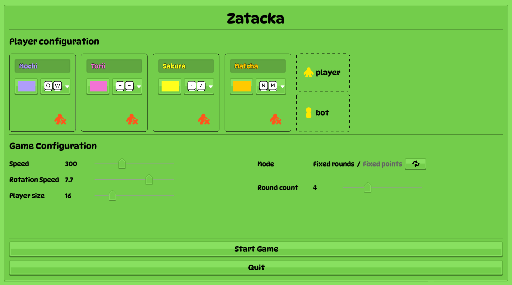
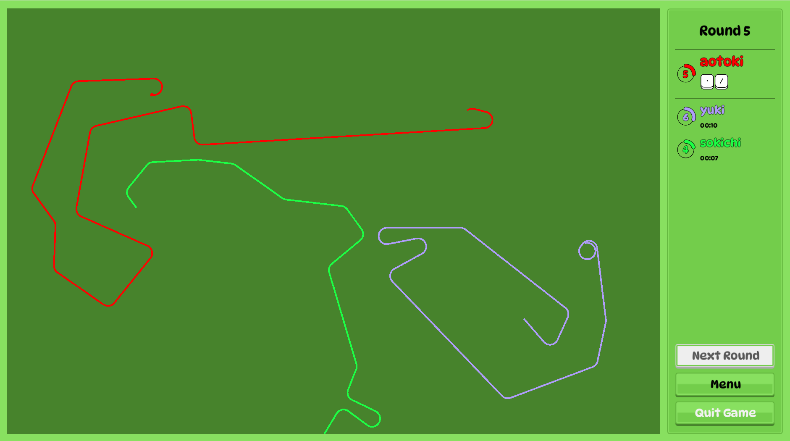
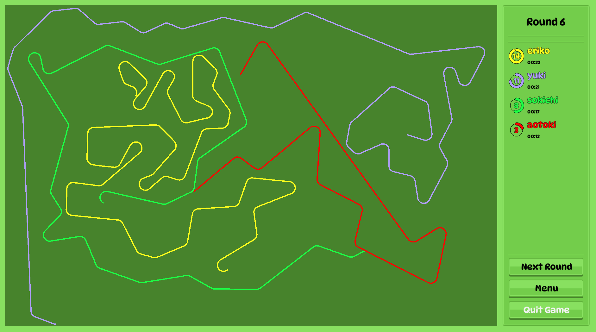

# Zatacka, Godot version

This is my remake of a classic Zatacka game, which itself is a remake of [Achtung, die Kurve!](https://en.wikipedia.org/wiki/Achtung,_die_Kurve!).

## Gameplay

* The game is played over multiple rounds, it's up to 6 players - all using the same keyboard 😆
* At the beginning of each round every player spawns as a dot in a random location and moves at a constant speed. Each player can turn left or right, using assigned keyboard buttons.
* As the dot moves, it leaves a solid trail
* Anyone who crashes into a wall or a trail (including theirs), is out of the round
* Whenever a player crashes, all remaining players get a point each
* The game ends once any player reaches a certain amount of points, or maximum number of rounds is reached

## Screenshots

## Roadmap

* [x] basic game mechanics
* [x] basic ui
* [x] points (every time a player crashes, all active players get point each)
* [x] player settings (player count, name, color, key binding)
* [x] game settings (speed in px/sec, rotation radius in px, player dot size in px)
* [x] mode: fixed roud count / fixed point count
* [x] ranking screen at the end of game
* [ ] start round coundow
* [ ] animations
  * [ ] player position at round start
  * [ ] player crashed
  * [ ] point gained
* [ ] next round start mode: manual (pressing "next round" button) / automatic (with configurable delay in sec)
* [ ] bots
* [ ] sound
  * [ ] music
  * [ ] effects (start game, crash, end round, etc)

## Implementation

Implementation done using [Godot](https://godotengine.org) game engine.

## Installation

If you have Godot installed, simply clone this repository and open as a Godot project. There are no released binaries yet, sorry...

## Motivation

This is my very first Godot project (and my first ever game!) and serves as a learning ground for me to learn Godot (and game development in general).

I chose to make it for a few reasons:
* the rules are simple, so it's easy to implement (or so I thought...)
* it holds a sentimental value - we used to play it a lot before classes at uni 😁

## Contribution

Spotted a bug? Want to contribute a feature? Or you have a general suggestion or question? Feel free to open an issue or submit a PR.
